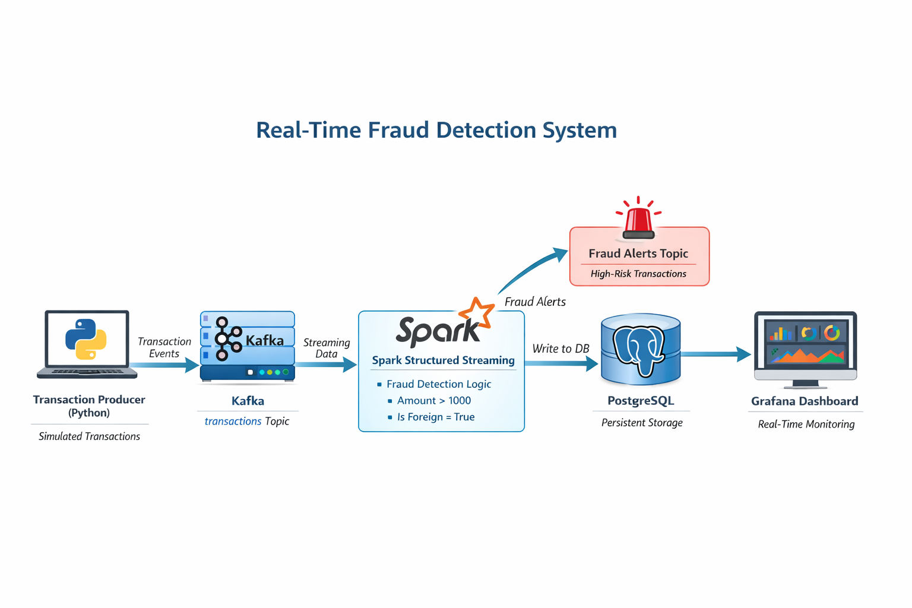

# Real-Time Fraud Detection System

## Overview
This project implements a **real-time fraud detection pipeline** using event-driven streaming architecture. It ingests live transaction events, processes them using Spark Structured Streaming, applies fraud rules, stores results in PostgreSQL, and visualizes insights via Grafana dashboards.

The system is designed to demonstrate **production-grade streaming concepts** such as fault tolerance, scalable ingestion, rule-based detection, and real-time observability.

---

## Architecture



### Data Flow
1. **Transaction Producer (Python)**  
   Simulates or ingests transaction events and publishes them to Kafka.

2. **Apache Kafka**  
   Acts as the distributed event backbone for high-throughput, fault-tolerant streaming.

3. **Apache Spark Structured Streaming**  
   Consumes transactions, parses JSON payloads, applies fraud detection logic, and routes:
   - All transactions → PostgreSQL
   - Fraudulent transactions → `fraud_alerts` Kafka topic

4. **PostgreSQL**  
   Stores transaction data for analytics and visualization.

5. **Grafana**  
   Provides real-time dashboards for monitoring transaction volumes and fraud trends.

---

## Tech Stack
- **Language:** Python
- **Streaming:** Apache Kafka, Spark Structured Streaming
- **Storage:** PostgreSQL
- **Visualization:** Grafana
- **Containerization:** Docker & Docker Compose

---

## Fraud Detection Logic
Current rule-based logic:
- Transaction amount > 1000
- Transaction is marked as foreign

This logic can be extended to ML-based scoring or anomaly detection.

---

## Project Structure
```
fraud-detection-system/
│
├── kafka/
│   ├── create_topics.py
│   └── transaction_producer.py
│
├── spark/
│   └── transaction_consumer.py
│
├── docker-compose.yml
├── architecture_diagram.png
└── README.md
```

---

## How to Run

### 1. Start Infrastructure
```bash
docker compose up -d
```

### 2. Create Kafka Topics
```bash
python kafka/create_topics.py
```

### 3. Start Spark Consumer
```bash
python spark/transaction_consumer.py
```

### 4. Start Transaction Producer
```bash
python kafka/transaction_producer.py
```

### 5. Access Services
- **Grafana:** http://localhost:3000
- **PostgreSQL:** localhost:5432
- **Kafka:** localhost:9092

---

## Observability
Grafana dashboards can visualize:
- Transaction volume over time
- Fraud vs non-fraud transactions
- High-risk transaction spikes

---

## Future Enhancements
- Machine learning–based fraud scoring
- Sliding-window aggregations
- Alerting via email/SMS
- Schema registry (Avro/Protobuf)
- Exactly-once processing semantics
- Kubernetes deployment

---

## License
MIT License
